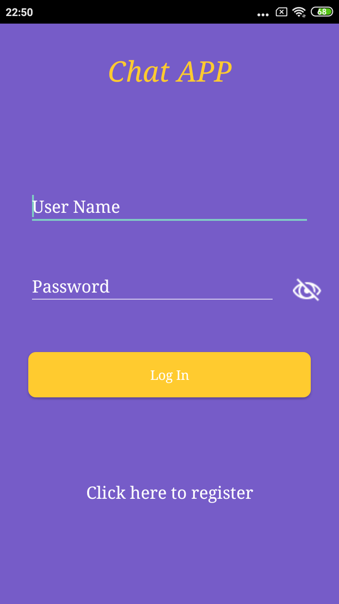
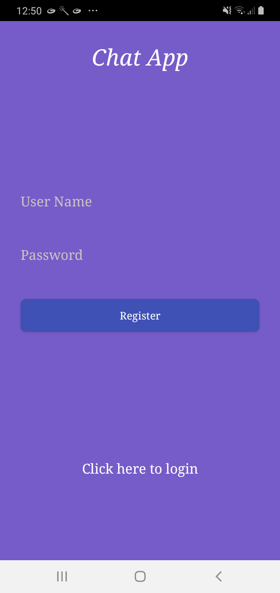
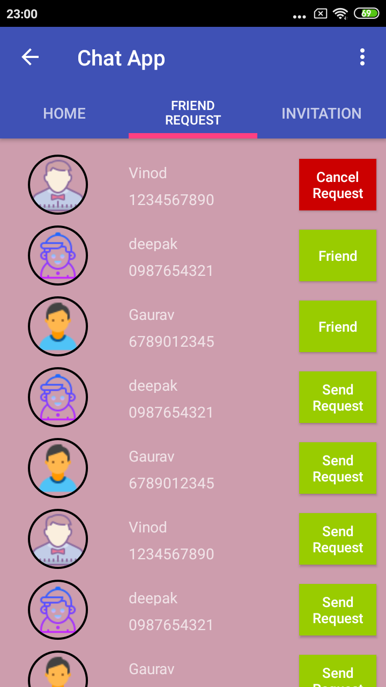

ChatAppFirebase : App for chatting.
----

Android Chatting Application using Firebase as a realtime server. Features include:

- Send and reject Friend Request.
- Chat anytime with friends.
- Without accepting friend request no chatting.
- Login with password: This feature make it secure as without password no one can access account.

### App Specifications:

- Java code 100%.
- [Firebase Realtime Sever](https://firebase.google.com/docs/database): For app realtime data Firebase is used.
- [Volley](https://developer.android.com/training/volley) : In some activity volley is used as networking library, some firebase database is used as Rest api so for that volley is used.
- [Circular image](https://github.com/hdodenhof/CircleImageView) for profile.

### App Packages:

- *activity:* all activity of project.

- *adapter:* inivitation and Main Activity (ViewPager) page adapter.

- *fragment:* All the fragment of project, which are Friend Request, Home, Invitation, Login, Registration.

- *interfaces:* interface for button click

- *model:* all model class of project.

- *utils:* files which can be used in entire project. Circular Image view, SharedPrefrance.

- *viewHolder:* Friend view holder. 

- [Relase apk](Apk/ChatApp.apk) for check/Try app.

Screenshot
---- 

<table>
  <tr>
    <td>
      
    </td>
    <td>
      
    </td>
    <td>
      
    </td>
  </tr>
</table>
 
 <table>
  <tr>
    <td>
      
    </td>
    <td>
      
    </td>
  </tr>
</table> 
