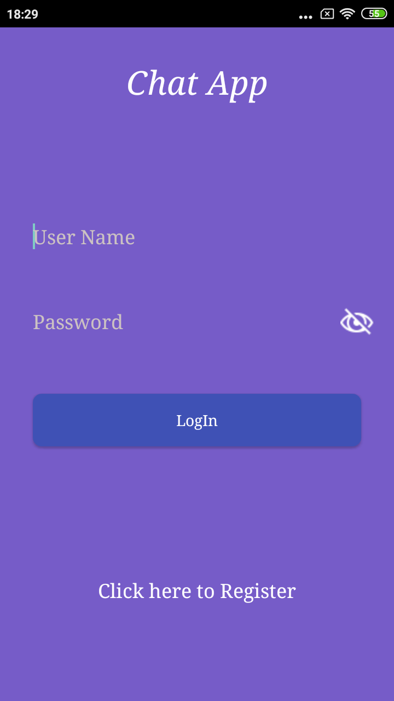
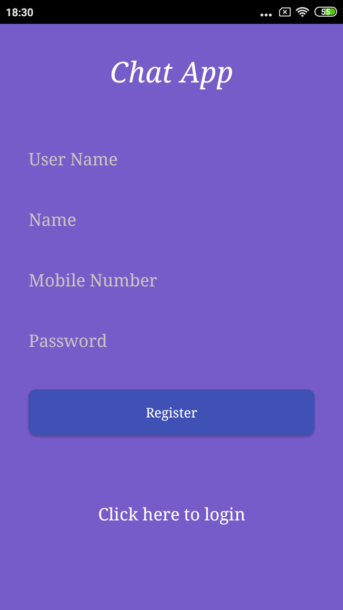
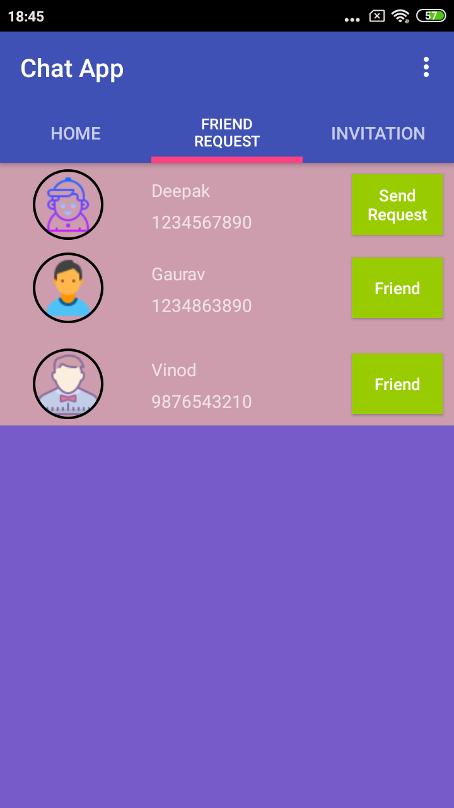

ChatAppFirebase
----

Android Chatting Application using Firebase as a realtime server.

Screenshot
===

<table>
  <tr>
    <td>
      
    </td>
    <td>
      
    </td>
    <td>
      
    </td>
  </tr>
</table>
 
 <table>
  <tr>
    <td>
      
    </td>
    <td>
      
    </td>
  </tr>
</table> 